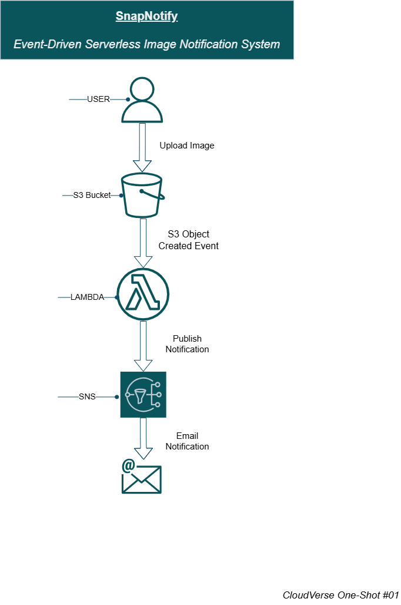

# SnapNotify Deployment Guide

| **Project** | SnapNotify |
|-------------|------------|
| **Version** | 1.0.0 |
| **Architecture** | Serverless, Event-Driven |
| **AWS Services** | Amazon S3, AWS Lambda, Amazon SNS, IAM, Amazon CloudWatch |
| **AWS Region** | us-east-1 (N. Virginia) |
| **Estimated Deployment Time** | 30–45 Minutes |
| **Difficulty** | Beginner |

---

# Overview

This document provides a step-by-step guide for deploying **SnapNotify**, a serverless event-driven application built on Amazon Web Services (AWS).

By following this guide, you will provision the required AWS resources, configure service integrations, and validate the complete workflow where uploading an image to Amazon S3 automatically triggers an AWS Lambda function, which publishes a notification through Amazon SNS.

---

# Architecture

    

---

# Prerequisites

Before beginning the deployment, ensure that you have:

- An active AWS account
- Access to the AWS Management Console
- A verified email address for Amazon SNS notifications
- Permission to create AWS resources within your AWS account

---

> **Important**
>
> The screenshots referenced throughout this guide are numbered in the order of execution to simplify navigation.
>
> Configure **only** the settings explicitly mentioned in each step or highlighted in the screenshots.
>
> Unless otherwise specified, leave all remaining AWS settings at their default values.

---

# Step 1 – Create an Amazon S3 Bucket

**Estimated Time:** 3–5 Minutes

## Objective

Create an Amazon S3 bucket that stores uploaded images and generates an event whenever a new object is created.

## Deployment Steps

1. Sign in to the AWS Management Console.
2. Navigate to **Amazon S3**.
3. Select **Create bucket**.
4. Enter a globally unique bucket name.
5. Choose the desired AWS Region.
6. Leave all remaining settings at their default values.
7. Select **Create bucket**.

## Expected Result

After completing this step:

- The Amazon S3 bucket appears in the S3 Console.
- The bucket is successfully created.
- The bucket contains no objects.

---

# Step 2 – Create an Amazon SNS Topic

**Estimated Time:** 3–5 Minutes

## Objective

Create an Amazon SNS topic that will publish notifications whenever a new image is uploaded.

## Deployment Steps

1. Navigate to **Amazon SNS**.
2. Select **Topics**.
3. Click **Create topic**.
4. Choose **Standard** as the topic type.
5. Enter a topic name.
6. Leave all remaining settings unchanged.
7. Click **Create topic**.

> **Note**
>
> A **Standard** topic is sufficient for this project because strict message ordering and exactly-once delivery are not required.

## Expected Result

After completing this step:

- The Amazon SNS topic is successfully created.
- The topic appears in the Topics dashboard.

---

# Step 3 – Create an Email Subscription

**Estimated Time:** 2–3 Minutes

## Objective

Subscribe an email address to receive notifications published to the Amazon SNS topic.

## Deployment Steps

1. Open the SNS topic.
2. Select **Create subscription**.
3. Choose **Email** as the protocol.
4. Enter the recipient email address.
5. Select **Create subscription**.
6. Open the confirmation email.
7. Confirm the subscription.

## Expected Result

After completing this step:

- The subscription status changes from **Pending Confirmation** to **Confirmed**.

---

# Step 4 – Create the AWS Lambda Function

**Estimated Time:** 5–7 Minutes

## Objective

Create an AWS Lambda function that processes Amazon S3 upload events and publishes notifications to Amazon SNS.

## Deployment Steps

1. Navigate to **AWS Lambda**.
2. Select **Create function**.
3. Choose **Author from scratch**.
4. Enter a function name.
5. Select the latest available Python runtime.
6. Create or choose the default execution role.
7. Select **Create function**.
8. Replace the default code with the SnapNotify Lambda function.
9. Click **Deploy**.

## Expected Result

After completing this step:

- The Lambda function is successfully created.
- The updated code is deployed.
- The Function Overview page is displayed.

---

# Step 5 – Configure IAM Permissions

**Estimated Time:** 3–5 Minutes

## Objective

Grant the Lambda execution role permission to publish notifications to Amazon SNS.

## Deployment Steps

1. Open the Lambda function.
2. Navigate to **Configuration → Permissions**.
3. Open the execution role.
4. Create an inline IAM policy.
5. Grant the `sns:Publish` permission for the required SNS topic.
6. Save the policy.

## Expected Result

After completing this step:

- The Lambda execution role contains the required permission to publish messages to Amazon SNS.

---

# Step 6 – Configure Environment Variables

**Estimated Time:** 2 Minutes

## Objective

Store the Amazon SNS Topic ARN as an environment variable.

## Deployment Steps

1. Open the Lambda function.
2. Navigate to **Configuration → Environment Variables**.
3. Select **Edit**.
4. Add the following environment variable:

| Key | Value |
|------|------|
| SNS_TOPIC_ARN | Amazon SNS Topic ARN |

5. Save the changes.

## Expected Result

The `SNS_TOPIC_ARN` environment variable appears in the Lambda configuration.

---

# Step 7 – Configure the Amazon S3 Trigger

**Estimated Time:** 2–3 Minutes

## Objective

Configure Amazon S3 to invoke the Lambda function whenever a new object is uploaded.

## Deployment Steps

1. Open the Lambda function.
2. Select **Add Trigger**.
3. Choose **Amazon S3**.
4. Select the previously created bucket.
5. Choose **All Object Create Events**.
6. Acknowledge the recursive invocation warning.
7. Click **Add**.

## Expected Result

The Amazon S3 trigger appears in the Lambda Function Overview.

---

# Step 8 – Validate the Deployment

**Estimated Time:** 3–5 Minutes

## Objective

Verify that the complete event-driven workflow operates successfully.

## Deployment Steps

1. Open the Amazon S3 bucket.
2. Upload an image file.
3. Wait a few seconds.
4. Open the subscribed email inbox.
5. Verify that the notification email has been received.
6. (Optional) Review the Lambda execution logs in Amazon CloudWatch.

## Expected Result

The deployment is successful when:

- The image uploads successfully.
- Amazon S3 generates an **Object Created** event.
- AWS Lambda is invoked automatically.
- Amazon SNS publishes a notification.
- The subscribed email address receives the notification.

---

# Deployment Validation Checklist

| Validation | Status |
|------------|:------:|
| Amazon S3 Bucket Created | ☐ |
| Amazon SNS Topic Created | ☐ |
| Email Subscription Confirmed | ☐ |
| AWS Lambda Function Deployed | ☐ |
| IAM Permissions Configured | ☐ |
| Environment Variable Added | ☐ |
| Amazon S3 Trigger Configured | ☐ |
| Email Notification Received | ☐ |

---

# Related Documentation

The following documents provide additional information about the SnapNotify project:

- [Project README](../README.md)
- [Cleanup Guide](cleanup-guide.md)
- [Troubleshooting Guide](troubleshooting.md)
- [FAQ](faq.md)
